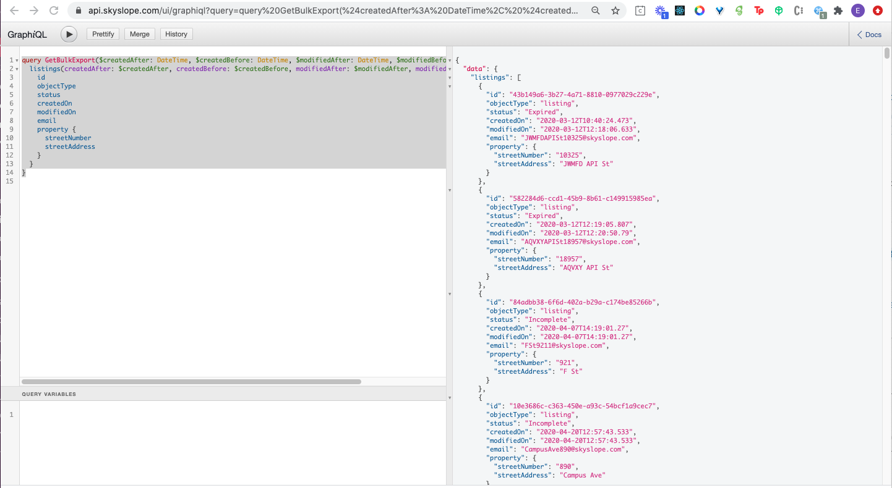

# graphql-bulk-export-api

## Getting started
1. Make sure node is installed on your machine
2. Clone the repo `git clone https://github.com/skyslope/graphql-bulk-export-api.git`
3. Replace the values in the .sampleENV file with your data and rename the file to `.env` from `.sampleENV`
4. Install the modules: dotenv, crypto, moment, and node-fetch: `yarn add dotenv crypto moment node-fetch`
5. Run the script: `yarn start`


## GraphQL Playground and documentation
### Introspection with GraphQL allows you to view the available data and types for each query

1. To use the graphQL playground, please make sure you have chrome installed on your machine and go to the following link in your chrome browser: [https://api.skyslope.com/ui/graphiql](https://api.skyslope.com/ui/graphiql).
2. If you're not authenticated, then you'll see the following message: `{"Error":"Unauthorized"}` in the browser.
3. No problem, you'll just need to authenticate. This requires you to have a plugin installed to modify headers. For example, [ModHeader](https://bewisse.com/modheader/help/).
4. Once you have a plugin installed that allows you to modify headers, you can add the session key and refresh the browser.

5. Now you can copy and paste your query into the graphiql tool:

    ```
    query GetBulkExport(
            $createdAfter: DateTime, 
            $createdBefore: DateTime, 
            $modifiedAfter: DateTime, 
            $modifiedBefore: DateTime
        ) {
            listings(
                createdAfter: $createdAfter, 
                createdBefore: $createdBefore, 
                modifiedAfter: $modifiedAfter, 
                modifiedBefore: $modifiedBefore
            ) {
                id
                objectType
                status
                createdOn
                modifiedOn
                email
                property {
                    streetNumber
                    streetAddress
                }
            }
    }
    ```

6. If needed, you can also add variable object:
    ```
    {
        "createdAfter": "2020-08-23", 
        "createdBefore": "2020-08-24",
        "modifiedAfter": "2020-08-23",
        "modifiedBefore": "2020-08-24"
    }
    ```
7. Then click the play icon 

### View documentation
- Then `< Docs` button on the top right of graphiql page .

## Adjusting your query
- Use the graphiql tool to refine your query and make sure you return the results you want.
- Once you're happy with the results, you can copy and paste your desired query and variables into your code.
    - In your repo, you can add or modify your query using file `gqlQuery.js`
    - You can also add or modify your variables using file `gqlVariables.js`
    - These files are located in the root of this folder.
